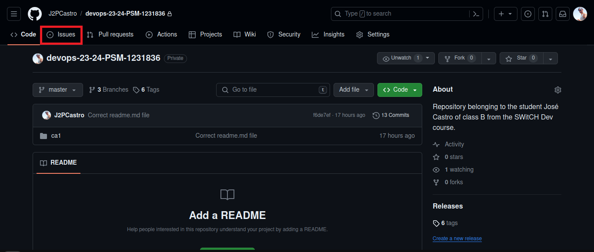
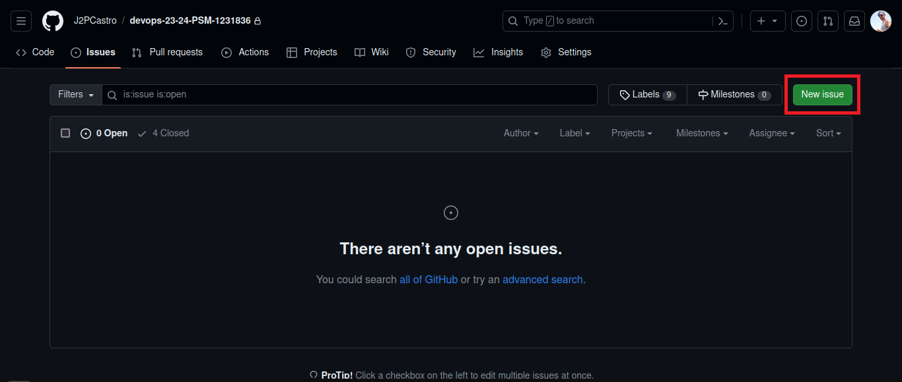
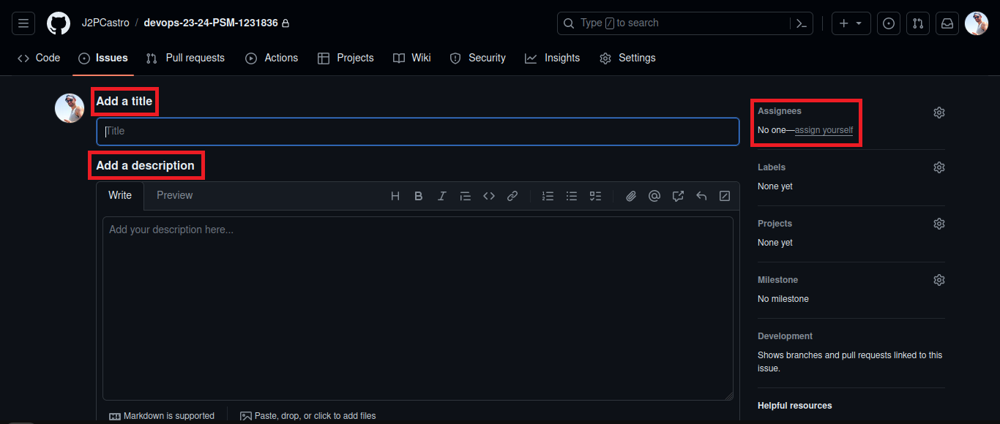
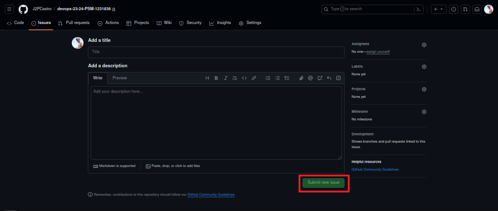
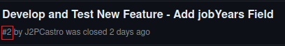

# Class Assignment 1 - Report

## Introduction

The objective of this report is to furnish a comprehensive overview of the inaugural class assignment. Said assignment
entails the establishment of a GitHub repository employing Git via the Command Line Interface (CLI). It initially
involves the inception of a local repository, followed by the establishment of a remote repository, culminating in the
synchronization of both repositories.

A simple Spring Boot application served as the developmental platform to introduce new functionalities. However,
paramount emphasis was placed on the utilization of Git and GitHub. The demonstrated proficiencies in this assignment
span from the creation of local repositories using Git through the CLI, to the synchronization of said repositories with
a remote GitHub repository, alongside the creation and merging of diverse branches.

This Class Assignment was made by the student José Castro nº1231836 of class B and the outcome of the work undertaken in
this assignment can be
found [here](https://github.com/J2PCastro/devops-23-24-PSM-1231836).

## Table of Contents

1. [Setup](#setup)
2. [Creating Issues](#creating-issues)
3. [Getting Started](#getting-started)
    1. [Create a local repository](#1-create-a-local-repository)
    2. [Copy the Spring Boot application to the repository](#2-copy-the-spring-boot-application-to-the-repository)
    3. [Add the files to the repository](#3-add-the-files-to-the-repository)
    4. [Commit the files to the repository](#4-commit-the-files-to-the-repository)
    5. [Push the repository to GitHub](#5-push-the-repository-to-github)
    6. [Add a new tag](#6-add-a-new-tag)
4. [Adding Features](#adding-features)
    1. [Part 1: Adding job years field](#part-1-adding-job-years-field)
        1. [Commit the changes to the repository](#1-commit-the-changes-to-the-repository)
        2. [Create a new tag for the new version](#2-create-a-new-tag-for-the-new-version)
        3. [Create a new tag to mark the end of the first part of the assignment](#3-create-a-new-tag-to-mark-the-end-of-the-first-part-of-the-assignment)
    2. [Part 2:](#part-2)
        1. [2.1.: Adding a new feature to the application: email field](#21-adding-a-new-feature-to-the-application-email-field)
            1. [Start by creating a new branch named email-field:](#1-start-by-creating-a-new-branch-named-email-field)
            2. [Commit the changes to the repository](#2-commit-the-changes-to-the-repository)
            3. [Merge the branch to the master branch](#3-merge-the-branch-to-the-master-branch)
            4. [Create a new tag for the new version](#4-create-a-new-tag-for-the-new-version)
        2. [2.2.: Bug fixes:](#22-bug-fixes)
            1. [Start by creating a new branch named fix-invalid-email:](#1-start-by-creating-a-new-branch-named-fix-invalid-email)
            2. [Commit the changes to the repository](#2-commit-the-changes-to-the-repository-1)
            3. [Merge the branch to the master branch](#3-merge-the-branch-to-the-master-branch)
            4. [Create a new tag for the new version](#4-create-a-new-tag-for-the-new-version)
            5. [Create a new tag to mark the end of the second part of the assignment](#5-create-a-new-tag-to-mark-the-end-of-the-second-part-of-the-assignment)
5. [Alternative to Git: Mercurial](#alternative-to-git-mercurial)
    1. [Using Mercurial to the goals of this assignment](#using-mercurial-to-the-goals-of-this-assignment)
        1. [Cloning a repository:](#1-cloning-a-repository)
        2. [Initializing a new repository:](#2-initializing-a-new-repository)
        3. [Add the files to the repository:](#3-add-the-files-to-the-repository)
        4. [Commit the files to the repository:](#4-commit-the-files-to-the-repository)
        5. [Push the repository to a remote location:](#5-push-the-repository-to-a-remote-location)
        6. [Add a tag to the commit:](#6-add-a-tag-to-the-commit)
        7. [Pushing tags:](#7-pushing-tags)
        8. [Creating branches in Mercurial:](#8-creating-branches-in-mercurial)
        9. [Switching branches:](#9-switching-branches)
        10. [Merging branches:](#10-merging-branches)
6. [Conclusion](#conclusion)

# Setup

The first step is to clone [this repository](https://github.com/spring-guides/tut-react-and-spring-data-rest) to your
local machine. This repository contains a simple Spring Boot application that we will use to demonstrate the use of Git
and GitHub.

To do so, simply create an empty directory on your machine. You can do so by opening a terminal and using the following
commands:

```bash
mkdir <directory-name>
```

Then, move into to the directory and clone the repository:

```bash
cd path/to/directory
git clone <repository-url>
```

- This second command clones the repository to the local machine.

The only directory needed for this assignment is the `basic` directory. The other directories are not needed.
Issues should be created in GitHub to track the progress of the assignment. It is assumed that a remote repository as
already been created in GitHub. If not, it should be created before proceeding.

# Creating Issues

To create issues in GitHub navigate to the repository in GitHub and click on the "Issues" tab.



Then click on the "New issue" button. This will open a new page where you can create a new issue.



Give the issue a title and a description. You can also assign the issue to a specific person, add labels, and set a
milestone. This is useful to keep track of the progress of the assignment.



Then click on the "Submit new issue" button. This will create a new issue in the repository.



The issue will be assigned a number, which can be used to reference the issue in the commit messages.



Create as many issues as necessary to track the progress of the assignment.

# Getting Started

## 1: Create a local repository

The first task is to create a local repository. This is done by navigating to a directory in your machine and creating
an empty directory giving it a name, without any blank spaces, preferably in all lower case. After this open
the CLI in the directory and run the following commands:

```bash
git init
```

- This command initializes a new Git repository in the directory. This creates a hidden directory named `.git` in the
  directory. This directory contains all the necessary files for the repository.

## 2: Copy the Spring Boot application to the repository

The next task is to copy the Spring Boot application to the repository. This is done by copying the `basic` directory
from the cloned repository to the local repository.

```bash
cp -r path/to/cloned/repository/basic path/to/local/repository
```

- This command copies the `basic` directory from the cloned repository to the local repository.
- The `-r` flag is used to copy directories and their contents recursively.

## 3: Add the files to the repository

The next task is to add the files to the repository. This is done by running the following commands:

```bash
git add .
```

- This command adds all the files in the directory to the staging area making them ready to be committed. This is always
  necessary before committing files to the repository.
- The `.` is a wildcard that matches all files in the directory.

## 4: Commit the files to the repository

The next task is to commit the files to the repository. This is done by running the following commands:

```bash
git commit -m "Initial commit. closes #1"
```

- This command commits the files in the staging area to the repository.
- The `-m` flag is used to specify a message for the commit. This message should be a short description of the changes
  made in the commit.
- It is always a good practice to commit files with a descriptive message.
- The `closes #1` is used to close the issue created in GitHub. This is a good practice to keep track of the progress of
  the assignment.

## 5: Push the repository to GitHub

Assuming a remote repository in GitHub is already created, the next task is to push the commit to GitHub. This is done
by running the following commands:

```bash
git branch -M master
git remote add origin <repository-url>
git push -u origin master
```

- The first command renames the current branch to master. This is always a good practice to keep the default branch
  named master. 
- The first command adds a remote repository named `origin` with the URL `<repository-url>`. This URL is the URL of the
  remote repository in GitHub. This second step is only necessary if the local repository is not yet linked to the remote
  one, as it is its function.
- The second command pushes the commit to the remote repository. The `-u` flag is used to set the remote repository as
  the default remote repository for the local repository. This means that in the future, the `git push` command can be
  used without specifying the remote repository and the branch to push to.

## 6: Add a new tag

The next task is to add a new tag to the repository. This is done by running the following commands:

```bash
git tag -a v1.1.0 -m "Initial Version"
git push origin v1.1.0
```

- This command adds a new tag named `v1.1.0` to the repository.
- The `-a` flag is used to specify that the tag is an annotated tag. An annotated tag is a tag that contains a message.
- The `-m` flag is used to specify a message for the tag. This message should be a short description of the changes made
  in the tag.
- The second command pushes the tag to the remote repository.

# Adding Features

## Part 1: Adding job years field

This first part is developed in the master branch. The goal is to add a new field to the application which will be the
number of years the user has been in the job. The actual Java implementation code is not covered in this report.

### 1. Commit the changes to the repository

After all the changes are made, the next step is to commit the changes to the repository. This is done by running the
following commands:

```bash
git add .
git commit -m "Add new feature jobYears field and tests for this new feature. closes #2"
git push origin master
```

- The first command adds all the files in the directory to the staging area making them ready to be committed. This is
  always necessary before committing files to the repository.
- The second command commits the files in the staging area to the repository. The `closes #2` is used to close the issue
  created in GitHub.

### 2. Create a new tag for the new version

After the changes are committed to the repository, the next step is to create a new tag for the new version:

```bash
git tag -a v1.2.0 -m "Version 1.2.0 with new JobYears feature"
git push origin v1.2.0
```

- The first command adds a new tag named `v1.2.0` to the repository.
- The second command pushes the tag to the remote repository.

### 3. Create a new tag to mark the end of the first part of the assignment

After all the changes are made, the next step is to create a new tag to mark the end of the first part of the
assignment:

```bash
git tag -a ca1-part1 -m "End of part 1 of class assignment 1"
git push origin ca1-part1
```

- The first command adds a new tag named `ca1-part1` to the repository.
- The second command pushes the tag to the remote repository.

## Part 2:

## 2.1.: Adding a new feature to the application: email field

This second part of the assignment should be developed using branches. The master branch should be used to ”publish” the
”stable” versions of the Tutorial React.js and Spring Data REST Application.

### 1. Start by creating a new branch named `email-field`:

```bash
git checkout -b email-field
```

- This command creates a new branch named email-field and switches to it.
- The -b flag is used to create a new branch.
- The email-field is the name of the new branch.

### 2. Commit the changes to the repository

After all the changes are made, the next step is to commit the changes. Since we are working with branches, things are
going to be slightly different. This is done by running the following commands:

```bash
git add .
git commit -m " Add new feature email field and tests for this new feature. closes #3"
git push origin email-field
```

- The first command adds all the files in the directory to the staging area making them ready to be committed.
- The second command commits the files in the staging area to the repository. The `closes #3` is used to close the issue
  created in GitHub.
- The third command pushes the commit to the remote repository. Since the branch wasn't pushed the remote repository
  before, this command not only pushes the commits but also the new branch to the remote repository.

### 3. Merge the branch to the master branch

After all this process it is necessary to merge the branch to the master branch. This is done by running the following
commands:

```bash
git checkout master
git merge --no-ff email-field
git push origin master
```

- The first command switches to the master branch.
- The second command merges the email-field branch to the master branch. The --no-ff flag is used to ensure that a new
  commit is created to merge the branches. This is always a good practice to keep track of the changes made in the
  branches.
- The third command pushes the commit to the remote repository.

### 4. Create a new tag for the new version

After the changes are committed to the repository, the next step is to create a new tag for the new version:

```bash
git tag -a v1.3.0 -m "Version 1.3.0 with new feature email field"
git push origin v1.3.0
```

- The first command adds a new tag named `v1.3.0` to the repository.
- The second command pushes the tag to the remote repository.

## 2.2.: Bug fixes:

Now that the email field is added to the application, it is necessary to fix a bug that allows invalid emails to be
added to the application. This is done by creating a new branch named `fix-invalid-email`:

### 1. Start by creating a new branch named `fix-invalid-email`:

```bash
git checkout -b fix-invalid-email
```

- This command creates a new branch named fix-invalid-email and switches to it.

### 2. Commit the changes to the repository

After all the changes are made, the next step is to commit the changes. This is done by running the following commands:

```bash
git add .
git commit -m "Add fixes so that email field only takes in valid email. closes #4"
git push origin fix-invalid-email
```

- The first command adds all the files in the directory to the staging area making them ready to be committed.
- The second command commits the files in the staging area to the repository. The `closes #4` is used to close the issue
  created in GitHub.
- The third command pushes the commit to the remote repository. Since the branch wasn't pushed the remote repository
  before, this command not only pushes the commits but also the new branch to the remote repository.

### 3. Merge the branch to the master branch

After all this process it is necessary to merge the branch to the master branch. This is done by running the following
commands:

```bash
git checkout master
git merge --no-ff fix-invalid-email
git push origin master
```

- The first command switches to the master branch.
- The second command merges the fix-email-field branch to the master branch. The --no-ff flag is used to ensure that a
  new
  commit is created to merge the branches. This is always a good practice to keep track of the changes made in the
  branches.
- The third command pushes the commit to the remote repository.

### 4. Create a new tag for the new version

After the changes are committed to the repository, the next step is to create a new tag for the new version:

```bash
git tag -a v1.3.1 -m "Version 1.3.1 with bug fixes to email field"
git push origin v1.3.0
```

- The first command adds a new tag named `v1.3.1` to the repository.
- The second command pushes the tag to the remote repository.

### 5. Create a new tag to mark the end of the second part of the assignment

After all the changes are made, the next step is to create a new tag to mark the end of the second part of the
assignment:

```bash
git tag -a ca1-part2 -m "End of part 2 of class assignment 1"
git push origin ca1-part2
```

- The first command adds a new tag named `ca1-part2` to the repository.
- The second command pushes the tag to the remote repository.

# Alternative to Git: Mercurial

Mercurial is a distributed version control system (DVCS) designed for managing projects of all sizes, from small to very
large. It was created by Matt Mackall in 2005 and is written mostly in Python. Like Git, Mercurial allows multiple
developers to work on the same project simultaneously while keeping track of changes made to the source code.

Mercurial and Git are both popular distributed version control systems (DVCS) used in software development, each with
its own strengths and nuances. While Git is more widely adopted and boasts a larger ecosystem of tools and services,
Mercurial is praised for its simplicity and ease of use. Git's branching model is more flexible and powerful, making it
ideal for complex projects with intricate workflows, whereas Mercurial offers a more straightforward approach to
branching that may appeal to teams seeking simplicity and clarity. Additionally, Git's command-line interface is more
feature-rich and customizable, while Mercurial's interface is often considered more intuitive and user-friendly.
Ultimately, the choice between Mercurial and Git depends on factors such as project complexity, team preferences, and
specific workflow requirements.

## Using Mercurial to the goals of this assignment

If needed, Mercurial can be used to achieve the same goals as Git. To do so, one would follow a similar workflow with
some differences in the commands used.

Different from Git, Mercurial uses the `hg` command to perform operations on the repository. This
is done by running the following command:

### 1. Cloning a repository:

```bash
hg clone <repository-url>
```

### 2. Initializing a new repository:

```bash
hg init
```

### 3. Add the files to the repository:

```bash
hg add .
```

### 4. Commit the files to the repository:

```bash
hg commit -m "commit message"
```

### 5. Push the repository to a remote location:

If we want to link our local repository with a remote one in Mercurial, the following command can be used:

```bash
hg paths default <repository-URL>
```

Alternatively, if we only want to push changes to the remote repository, the following command can be used:

```bash
hg push -b <branch-name>
```

- The -b flag is used to specify the branch to push to the remote repository.
- The -b flag can be removed if we want to push the changes to the default branch.

### 6. Add a tag to the commit:

To add a tag to the commit, the following command can be used:

```bash
hg tag -m "message" <tag-name>
```

- The -m flag is used to specify a message for the tag.
- The <tag-name> is the name of the tag.

### 7. Pushing tags:

To push the tags to the remote repository, the following command can be used:

```bash
hg push . --rev <tag-name>
```

- The --rev flag is used to specify the revision to push to the remote repository.
- The <tag-name> is the name of the tag.

### 8. Creating branches in Mercurial:

```bash
hg branch <branch-name>
```

### 9. Switching branches:

```bash
hg update <branch-name>
```

### 10. Merging branches:

```bash
hg merge  --tool internal:merge <branch-name>
```

- The --tool flag is used to specify the merge tool to use. In this case, the internal:merge tool is used.
- The <branch-name> is the name of the branch to merge.

By replicating the workflow used in Git, it is possible to achieve the same goals using Mercurial. The commands used in
Mercurial are slightly different from the ones used in Git, but the overall process is similar.

# Conclusion

In this article, we have discussed the process of using Git to manage a software development project. We
have covered the basic concepts of version control, the benefits of using Git, and the steps involved in setting up a
Git repository, making changes to the code, and collaborating with other developers. We have also discussed the
importance of using branches to manage different features and bug fixes, and the process of merging branches and
creating
tags to mark the end of different parts of the assignment. Finally, we have briefly discussed the alternative of using
Mercurial as a distributed version control system. By following these best practices and using the right tools, software
development teams can effectively manage their projects and collaborate with other developers to build high-quality
software products.

Hope the work developed here meets all exceptions for this class assignment. Thank you for your attention.